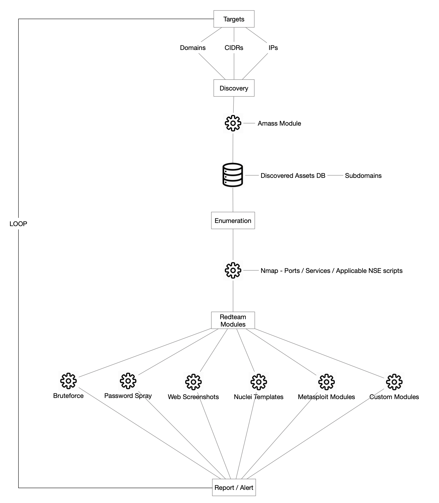
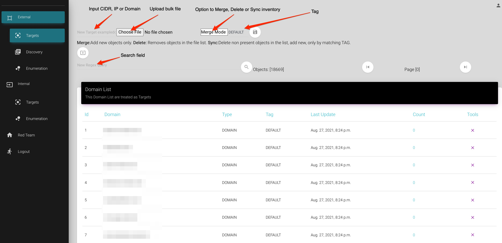
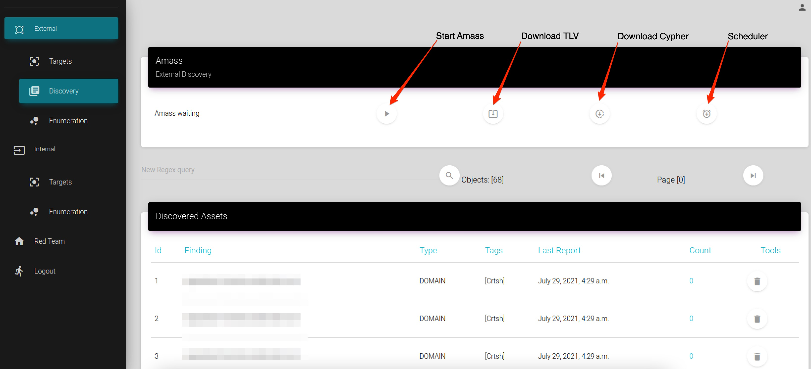
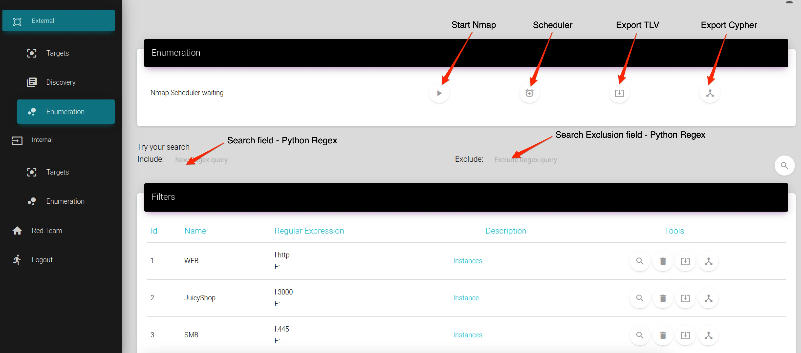
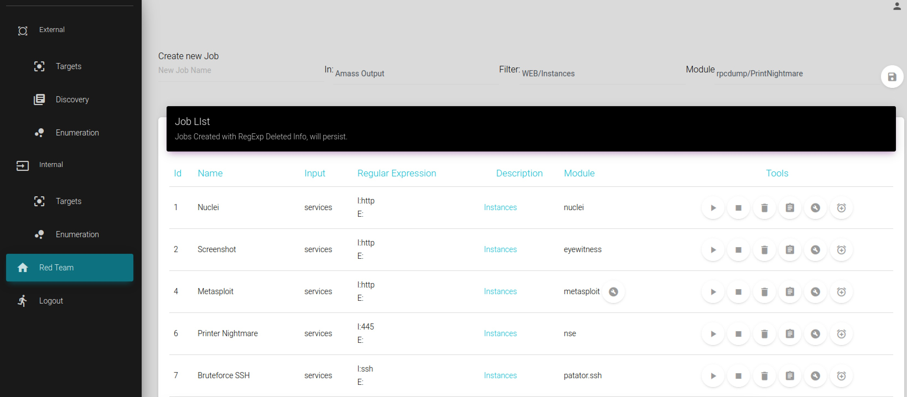

# Attack Surface Framework 

## Overview

ASF aims to protect organizations acting as an attack surface watchdog, provided an “Object” which might be a: Domain, IP address or CIDR (Internal or External), ASF will discover assets/subdomains, enumerate their ports and services, track deltas and serve as a continuous and flexible attacking and alerting framework leveraging an additional layer of support against 0 day vulnerabilities with publicly available POCs.

## Motivation

The lack of support and flexibility to automate discovery of dynamic assets and their associated vulnerabilities through continuous scanning or exploitation in a single pane of glass was the driving force in the creation of ASF, the current solutions are restricted by the technology or the program they are built for, we wanted a solution that is scalable as well as utilizes popular Open Source security tools for handling a full vulnerability lifecycle.

ASF is a breed of open source projects leveraging a powerful arsenal of tools wrapped in a single pane of glass on top of a GUI. ASF architectural diagram illustrated below:



### Prerequisites

Latest version of Kali Linux (tested on 64 bits) - https://kali.org/get-kali/

16 GB of RAM at least

1 TB HD - XFS filesystem recommended

### Build & Run

Execute the following steps as the `root` user to install and run the Attack Surface Framework.

1. Clone the Repository
   - Clone the ASF repository to your `/opt/` directory.
   ```
   git clone https://github.com/vmware-labs/attack-surface-framework.git /opt/asf
   ```
2. cd `/opt/asf/`
3. Configure Environment File 
   - Create a `.env.prod` file in the project directory. This is crucial for `setup.sh` to run properly.

      **Note**: You can generate a `.env.prod` file or copy from `backup.env.prod`, making the necessary changes to adapt to your environment.
   - Example structure of `.env.prod`:
    
      ```
       # Django settings, don't enable debug on production!
       DEBUG=True
       DJANGO_ADMIN_ENABLED=True
    
       #LOGIN CONFIGURATIONS
       LOGIN_FORM=True
       SOCIAL_AUTH_GOOGLE_ENABLED=False
       SOCIAL_AUTH_GITHUB_ENABLED=False
    
    
       DJANGO_SAML2_ENABLED=False  #Enable Social Authenticatio with Google. 
       SAML2_SSO_URL=https://saml2.local
       SAML2_ASF_URL=https://atttacksurfaceframework.local
    
    
    
       ALLOWED_HOSTS=*,localhost, config('SERVER', default='127.0.0.1')
    
    
       MONGO_USER=admin
       MONGO_PASSWORD=
       MONGO_URL=
       MONGO_PORT=27017
    
    
       JIRA_ENABLED=False
       JIRA_TOKEN=
       JIRA_URL=
       JIRA_USER=
       JIRA_SEVERITY={"info":"Lowest","low":"Low","medium":"Medium","high":"High","critical":"Highest"}
       JIRA_PROJECT=""
       WPScan_Default_Severity=medium
       ```

      - Note: MongoDB is necessary for the alerting or reporting functions of ASF. 

          - If you opt to run your MongoDB instance, use the following command:

          ```
          docker run -dp 27017:27017 -v local-mongo:/data/db --name local-mongo --restart=always -e MONGO_INITDB_ROOT_USERNAME=<<>> -e MONGO_INITDB_ROOT_PASSWORD=<<>> mongo
          ```

          - And update `.env.prod` with following details:

          ```
          MONGO_USER=admin
          MONGO_PASSWORD=
          MONGO_URL=
          MONGO_PORT=27017
          ```
   
4. Run `./setup.sh`


For Local Kali Linux Environment: Navigate to http://127.0.0.1:2021 in your web browser to access ASF

### Secure Access to ASF

ASF is not meant to be publicly exposed, assuming you install it on a cloud provider or even on a local instance, we recommend to access it using port forwarding through SSH, here is an example:

`ssh -i "key.pem" -L 2021:127.0.0.1:2021 user@yourhost` - For ASF GUI


Then open your browser and go to: 

`http://127.0.0.1:2021` - For ASF - user:youruser pass:yourpass (provided in initial setup)

**Security Tip**:  Ensure each component, including MongoDB, is securely configured, and that ASF is accessed securely, even internally. Adhering to security best practices is crucial when implementing ASF in your security strategy.

###### Social Login 

Additionally you may configure social login by enabling the right social login feature in .env.prod 

```
#LOGIN CONFIGURATIONS
LOGIN_FORM=True
SOCIAL_AUTH_GOOGLE_ENABLED=True (False)
SOCIAL_AUTH_GITHUB_ENABLED=True (False)
DJANGO_SAML2_ENABLED=True (False)
```
Navigating to admin panel http://127.0.0.1:2021/admin to add the social app. 

`Note that if social login is enabled and not configured in admin panel ASF will not display the login page - to revert simply disable the Social Login in .env.prod`


###### Jira Integration

To enable Jira integration and ticketing, ASF supports setting the following values in the .env.prod file: 

```
JIRA_ENABLED=True
JIRA_TOKEN=
JIRA_URL=
JIRA_USER=
JIRA_SEVERITY={"info":"Lowest","low":"Low","medium":"Medium","high":"High","critical":"Highest"}
JIRA_PROJECT=
```


###### WPScan Integration

To use Wordpress Scan in Red team modules insert WPScan API token in line #7 of `redteam/wpscan/wpscan.sh`

### Documentation

ASF has two scopes:

A) External: For your publicly exposed assets.

B) Internal: Assets in your corporate network.

For the External scope, the flow goes through four basic steps: 

A.1 Targets - Here is where you input your targets



A.2 Discovery - Module that runs the Amass process to discover publicly exposed assets, feel free to create your configuration file to setup your API keys https://github.com/OWASP/Amass/blob/master/examples/config.ini



A.3 Enumeration - Module that runs the NMAP process to enumerate ports/services and create filters for the Redteam module. Default setup is to look for `--top-ports 200` but you can suit it to your needs in /opt/asf/tools/nmap/*.sh



A.4 Redteam - Module that runs submodules located in "/opt/asf/redteam"



Note: For the Internal scope, the flow goes through A.1(Targets),A.3(Enumeration) and A.4(Redteam). 

### Contributing

The attack-surface-framework project team welcomes contributions from the community. Before you start working with attack-surface-framework, please
read our [Developer Certificate of Origin](https://cla.vmware.com/dco). All contributions to this repository must be
signed as described on that page. Your signature certifies that you wrote the patch or have the right to pass it on
as an open-source patch. For more detailed information, refer to [CONTRIBUTING.md](CONTRIBUTING.md).

### License

Attack Surface Framework
Copyright 2021 VMware, Inc.

The BSD-2 license (the "License") set forth below applies to all parts of the Attack Surface Framework project. You may not use this file except in compliance with the License.

BSD-2 License 

Redistribution and use in source and binary forms, with or without modification, are permitted provided that the following conditions are met:

Redistributions of source code must retain the above copyright notice, this list of conditions and the following disclaimer.

Redistributions in binary form must reproduce the above copyright notice, this list of conditions and the following disclaimer in the documentation and/or other materials provided with the distribution.

THIS SOFTWARE IS PROVIDED BY THE COPYRIGHT HOLDERS AND CONTRIBUTORS "AS IS" AND ANY EXPRESS OR IMPLIED WARRANTIES, INCLUDING, BUT NOT LIMITED TO, THE IMPLIED WARRANTIES OF MERCHANTABILITY AND FITNESS FOR A PARTICULAR PURPOSE ARE DISCLAIMED. IN NO EVENT SHALL THE COPYRIGHT HOLDER OR CONTRIBUTORS BE LIABLE FOR ANY DIRECT, INDIRECT, INCIDENTAL, SPECIAL, EXEMPLARY, OR CONSEQUENTIAL DAMAGES (INCLUDING, BUT NOT LIMITED TO, PROCUREMENT OF SUBSTITUTE GOODS OR SERVICES; LOSS OF USE, DATA, OR PROFITS; OR BUSINESS INTERRUPTION) HOWEVER CAUSED AND ON ANY THEORY OF LIABILITY, WHETHER IN CONTRACT, STRICT LIABILITY, OR TORT (INCLUDING NEGLIGENCE OR OTHERWISE) ARISING IN ANY WAY OUT OF THE USE OF THIS SOFTWARE, EVEN IF ADVISED OF THE POSSIBILITY OF SUCH DAMAGE.

## Notice

Attack Surface Framework
Copyright 2021 VMware, Inc.

This product is licensed to you under the BSD-2 license (the "License"). You may not use this product except in compliance with the BSD-2 License.  

This product may include a number of subcomponents with separate copyright notices and license terms. Your use of these subcomponents is subject to the terms and conditions of the subcomponent's license, as noted in the LICENSE file. 

### Credits

https://www.djangoproject.com/

https://github.com/creativetimofficial/material-dashboard-django

https://nmap.org/

https://github.com/OWASP/Amass

https://github.com/lanjelot/patator

https://github.com/FortyNorthSecurity/EyeWitness

https://github.com/projectdiscovery/nuclei

https://www.metasploit.com

https://www.kalilinux.org

https://www.graylog.org/products/open-source

https://github.com/wpscanteam/wpscan

https://github.com/vanhauser-thc/thc-hydra

https://nxlog.co/products/nxlog-community-edition

https://www.docker.com/

## Presented at 
### Blackhat Arsenal - https://www.blackhat.com/us-21/arsenal/schedule/index.html#vdoberman-24096

### Defcon Demolabs - https://forum.defcon.org/node/246317

